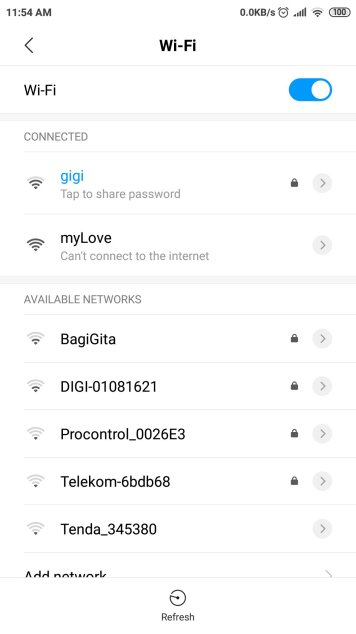

# esp8266 captive portal demo
Serving as public free wifi hotspot and on connect showing main page.

It has a small Valentn's day demo just to have soem samle content but coudb be used for advertisement/dating/public surveys etc....

## Current Functionalities

* serving itself as a free wifi hotspot
* captive portal on conect show immediately the main page usially used for accepting free wifi policies or setting credentials
* SPIFFS data can be used to load html files etc

# Pictures of the portal

